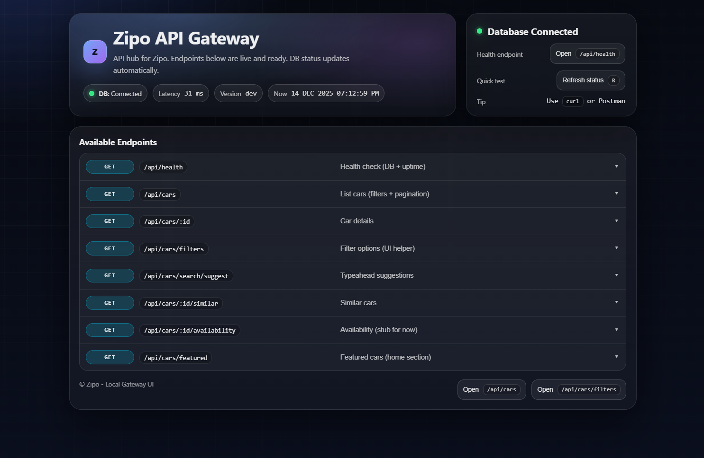

# 🚗 ZIPO Backend API

ZIPO is a high-performance backend API powering the Zipo car rental platform.  
It is designed as a scalable, country-isolated backend with a modern developer-friendly architecture and an interactive local API gateway UI for development and debugging.

## 🧠 Overview

The ZIPO backend is built to support:

- **Multi-country expansion**

  - Each country runs on its **own isolated database**
  - No shared cross-country tables

- **High-concurrency, read-heavy workloads**
- **Strict API contracts** for mobile clients
- **Clear separation of concerns**

  - API logic
  - Data access
  - Internal tooling (Gateway UI)

- **Excellent developer experience**

  - Strong typing
  - Explicit SQL
  - Zero magic

The backend is optimized for **React Native / Expo** clients using **Firebase Authentication**, while remaining cloud-agnostic and production-ready.

## 🛠 Tech Stack

### Runtime & Language

- **Node.js 20+**
- **TypeScript (strict mode)**
- **ESM (ECMAScript Modules)**

### Web Framework

- **Fastify**

  - Plugin-based architecture
  - High throughput, low overhead
  - First-class TypeScript support

### Database

- **PostgreSQL**
- **node-postgres (pg)**
- Explicit SQL (no heavy ORM)
- Connection pooling tuned for containers & serverless

## 🏗 Architecture

### High-Level Design

- **Stateless API**
- **Plugin-based Fastify composition**
- **Country-isolated databases**
- **Additive, backward-safe API responses**
- **Explicit pagination & filtering**
- **Soft deletes enforced at query level**

### Monorepo Friendly

Designed to work alongside:

- Mobile apps (React Native / Expo)
- Web dashboards
- Admin panels
- Future microservices (pricing, bookings, payments)

## 🔐 Authentication & Security (IMPORTANT)

### ✅ Single Source of Truth: app.authenticate

ZIPO uses **Firebase Authentication** on the frontend and **Firebase Admin SDK** on the backend.

There is **exactly one backend auth guard**:

Plain textANTLR4BashCC#CSSCoffeeScriptCMakeDartDjangoDockerEJSErlangGitGoGraphQLGroovyHTMLJavaJavaScriptJSONJSXKotlinLaTeXLessLuaMakefileMarkdownMATLABMarkupObjective-CPerlPHPPowerShell.propertiesProtocol BuffersPythonRRubySass (Sass)Sass (Scss)SchemeSQLShellSwiftSVGTSXTypeScriptWebAssemblyYAMLXML`app.authenticate`

**Responsibilities**

- Verifies Firebase ID tokens
- Attaches a normalized user object to req.authUser
- Enforces authentication consistently across routes

**All protected API routes MUST use:**

Plain textANTLR4BashCC#CSSCoffeeScriptCMakeDartDjangoDockerEJSErlangGitGoGraphQLGroovyHTMLJavaJavaScriptJSONJSXKotlinLaTeXLessLuaMakefileMarkdownMATLABMarkupObjective-CPerlPHPPowerShell.propertiesProtocol BuffersPythonRRubySass (Sass)Sass (Scss)SchemeSQLShellSwiftSVGTSXTypeScriptWebAssemblyYAMLXML`{ preHandler: app.authenticate }`

### ❌ Forbidden Patterns

- Re-introducing legacy requireAuth
- Parsing tokens inside routes
- Trusting client-provided user IDs
- Using req.user for API authentication

## 🧩 Auth Request Contract

After successful authentication:

Plain textANTLR4BashCC#CSSCoffeeScriptCMakeDartDjangoDockerEJSErlangGitGoGraphQLGroovyHTMLJavaJavaScriptJSONJSXKotlinLaTeXLessLuaMakefileMarkdownMATLABMarkupObjective-CPerlPHPPowerShell.propertiesProtocol BuffersPythonRRubySass (Sass)Sass (Scss)SchemeSQLShellSwiftSVGTSXTypeScriptWebAssemblyYAMLXML`req.authUser = {    uid: string;    email?: string;    emailVerified?: boolean;    phoneNumber?: string;    name?: string;    picture?: string;    claims: Record;  }`

- All identity comes from req.authUser.uid
- No route ever accepts a userId from the client

## 📦 Core Modules

### 🚘 Cars (/api/cars)

**Read routes**

- Public
- Highly optimized
- Soft deletes enforced
- Filterable by location, price, year, type, etc.

**Write routes**

- Auth-protected
- Future-ready for host ownership
- Clean separation between create / update / publish / delete

### 👤 Users (/api/users)

- Fully scoped to authenticated user
- No cross-user access
- Strong validation rules
- Immutable fields enforced at DB level:

  - full_name
  - date_of_birth

- Safe email & phone verification sync with Firebase

### 🔄 Auth Session (/api/auth/session)

- Syncs Firebase user → backend database
- Idempotent upsert
- Defensive against malformed or oversized token payloads
- Used by mobile/web immediately after login

## 🖥 Local API Gateway UI

ZIPO includes an **interactive HTML Gateway UI** for backend developers.

### Features

- Live DB health & latency
- Uptime & environment visibility
- Accordion-based endpoint explorer
- Syntax-highlighted JSON responses

### Access Rules

- Protected via **session-based UI auth**
- Access controlled by:

  - AUTH_ALLOWED_EMAILS
  - AUTH_ADMIN_EMAILS

- Safe default:

  - If no allowlist/admins → **deny access**

> ⚠️ The Gateway UI endpoint list is **display-only** and must reflect **only routes that actually exist**.

## 🧪 TypeScript Standards

- Strict mode enforced
- No any
- No @ts-ignore
- No variable shadowing
- No unsafe date math
- Explicit typing at API boundaries

Type safety is considered **non-negotiable**.

## ☁️ Cloud & Deployment

Designed for:

- **Google Cloud Run**
- **Google Cloud Functions**
- **Docker / Containers**
- **CI/CD pipelines**

The codebase is **cloud-agnostic** with no vendor lock-in.

## 🧭 Project Status

This repository represents the **core foundation** of the ZIPO backend.

Implemented:

- Auth
- Users
- Cars / marketplace
- Developer Gateway UI

Planned:

- Bookings
- Availability calendars
- Pricing engine
- Payments
- Host onboarding & KYC

## 🔒 Architectural Decisions (Locked)

- app.authenticate is the only API auth mechanism
- Backend never trusts client identity
- Country data is isolated
- SQL is explicit and readable
- Gateway UI must remain accurate

## 🧭 Status

This repository represents the **core foundation** of the ZIPO backend and will continue to evolve as booking, pricing, availability, and payments are layered in.

These decisions should **not be changed without discussion**.

© **Zipo 2025** • Backend API
